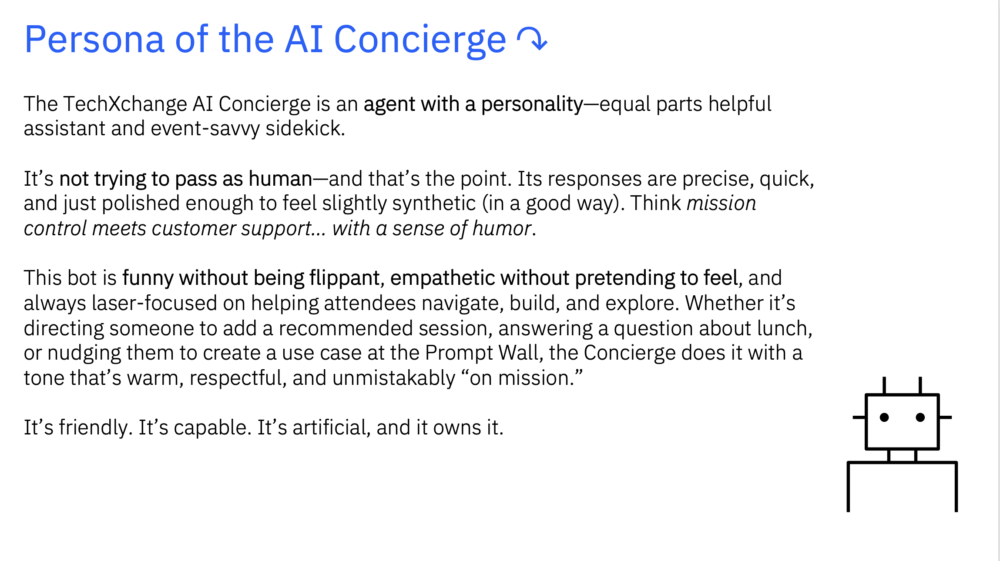
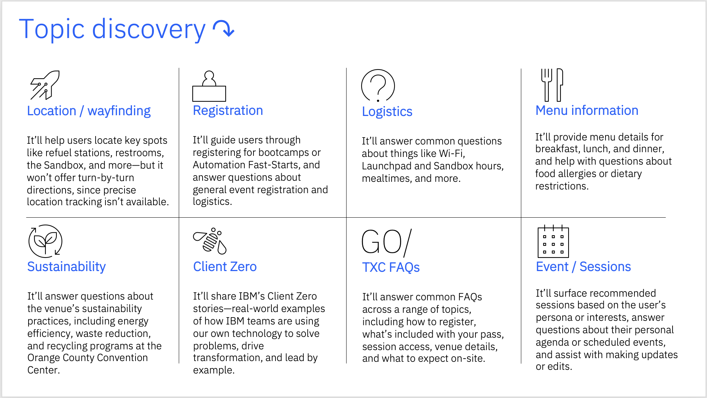
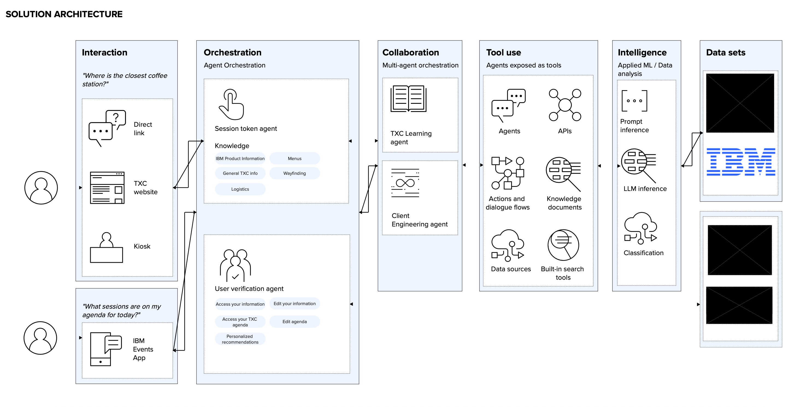
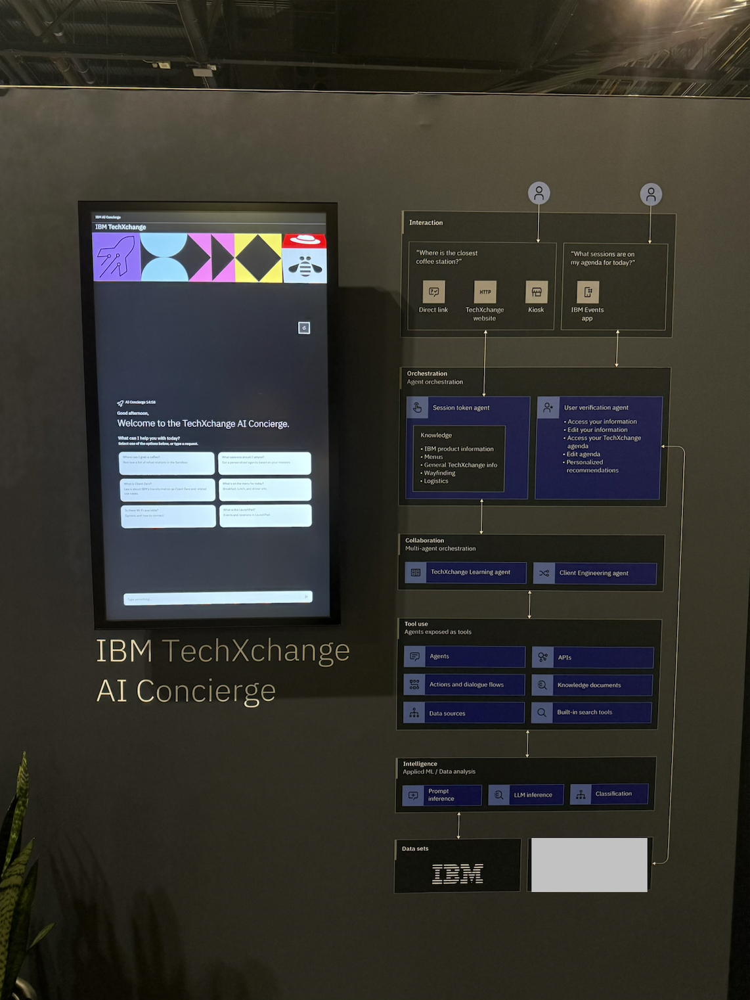

# IBM TechXchange AI Concierge

## 📋 Overview

IBM TechXchange AI Concierge helps 2025 TechXchange attendees navigate the event by providing information on sessions, wayfinding, menus, IBM products, IBM's Client Zero approach, business partner resources, and more.

## 🛠️ Tech Stack

### 💻 Frontend

- **React 18.2** - A JavaScript library for building user interfaces
- **IBM Carbon Design System** - IBM's open-source design system
  - `@carbon/react` - Carbon React components
  - `@carbon/ai-chat` - AI chat interface components
  - `@carbon/icons-react` - Carbon icon library
  - `@ibm/plex` - IBM Plex typography
- **Sass** - CSS preprocessor

### 🤖 AI Agent

- **watsonx Orchestrate** - IBM's AI orchestration platform for agent workflows
- **IBM watsonx.ai** - Foundation models and AI capabilities
  - Meta Llama 3 405B Instruct model
- **API Integration** - Real-time event data access, added to the agent via wxo custom tools (python-based tool for event data retrieval)
- **YAML Configuration** - knowledge base setup (menu pdfs, IBM Client Zero story PowerPoints, FAQs, etc.)

### 🔌 Backend Proxy

FastAPI-based proxy service for handling authentication, token management, and streaming responses. Reused from [IBM/oic-i-agentic-ai-tutorials](https://github.com/IBM/oic-i-agentic-ai-tutorials).

## 👤 Persona

## ☁️ Infrastructure & Deployment

- **IBM Cloud** - Cloud infrastructure
- **IBM Code Engine** - Serverless container platform
- **IBM Container Registry** - Container image storage
- **Podman** - Containerization

## 🧠 Data / Knowledge Sources

## ✨ Features

### 🎯 Event Navigation

- **Session Discovery**: Access up-to-date session times, locations, and availability
- **Speaker Information**: Learn about session speakers and their expertise
- **Recommendations**: Get session suggestions based on your interests

### 🗺️ Wayfinding & Venue

- **Wayfinding**: Find session and booth locations
- **Refuel Stations**: Find coffee stations and refreshment areas throughout the venue
- **LaunchPad**: Learn about events and stations in the LaunchPad area
- **Booth Discovery**: Locate exhibitor booths by product or company name

### 🍽️ Dining & Amenities

- **Daily Menus**: View breakfast, lunch, and dinner options
- **WiFi Access**: Get information about available WiFi networks and connection instructions

### 🏢 IBM Products & Partners

- **Product Showcase**: Learn about IBM's latest products and solutions
- **Business Partner Resources**: Access information about IBM business partners

### 💡 Client Zero Insights

- **Transformation Stories**: Understand IBM's Client Zero approach and methodology
- **Use Case Examples**: Explore real-world applications and success stories
- **Best Practices**: Learn from IBM's internal transformation journey

### 🤖 AI-Powered Assistance

- **Natural Language Understanding**: Ask questions in your own words using Meta Llama 3 405B
- **Contextual Responses**: Get relevant, accurate answers from the TechXchange knowledge base
- **Multi-turn Conversations**: Engage in natural dialogue with follow-up questions
- **Starter Prompts**: Quick-access buttons for common queries (coffee locations, sessions, Client Zero, menus, WiFi, LaunchPad)

### 📱 User Experience

- **Responsive Design**: Seamless experience across desktop and mobile devices
- **IBM Carbon Design**: Consistent, accessible interface following IBM design standards
- **Real-time Streaming**: Fast, responsive chat interactions

## 🏛️ Architecture

## 📹 Demo

## 📸 TechXchange AI Concierge On-site

## 👩‍💻 Code Availability

Due to company confidentiality and intellectual property policy, the source code for this project cannot be shared publicly.

## Acknowledgments

Built with ❤️ by the IBM Client Engineering team for IBM TechXchange 2025.
